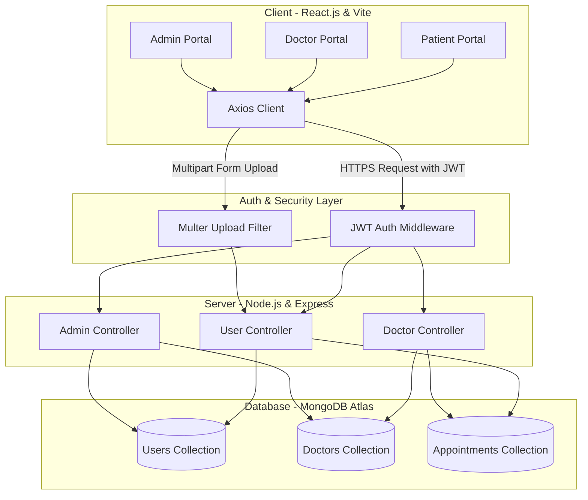
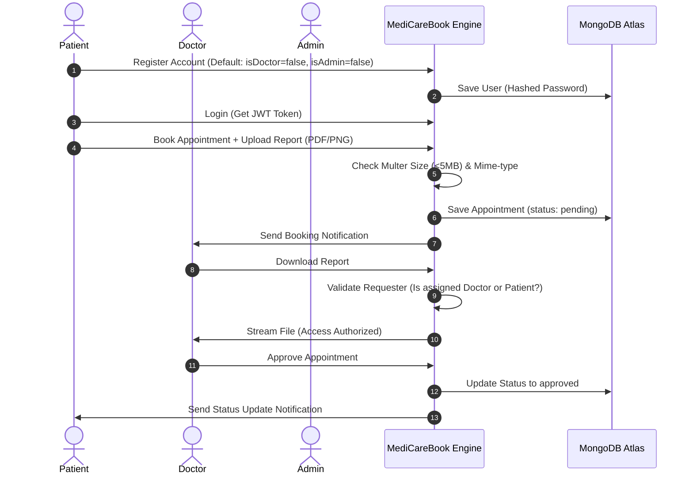
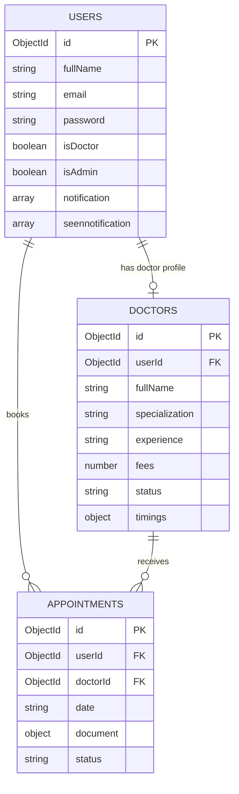

# Book A Doctor – MediCareBook
### Online Doctor Appointment & Health Record Booking System
Developed by **Nanda Gunasri** • Batch **VIP_FSD_C2_2026** • SmartBridge Full Stack Developer Program (MERN)

---

[](https://react.dev)
[](https://mongodb.com)
[](https://expressjs.com)
[](https://nodejs.org)
[](#)
[](#)

---

## 1. Project Banner

```
+-----------------------------------------------------------------------------------+
|                                                                                   |
|    __  __           _ _  _____                 ____             _                 |
|   |  \/  |         | (_)/ ____|               |  _ \           | |                |
|   | \  / | ___   __| |_| |     __ _ _ __ ___  | |_) | ___   ___| | __             |
|   | |\/| |/ _ \ / _` | | |    / _` | '__/ _ \ |  _ < / _ \ / _ \ |/ /             |
|   | |  | |  __/| (_| | | |___| (_| | | |  __/ | |_) | (_) | (_) |   <              |
|   |_|  |_|\___| \__,_|_|\_____\__,_|_|  \___| |____/ \___/ \___/|_|\_\             |
|                                                                                   |
|                ONLINE DOCTOR APPOINTMENT & HEALTH RECORD BOOKING SYSTEM           |
|                                                                                   |
+-----------------------------------------------------------------------------------+
```

---

## 2. Project Overview

**Book A Doctor (MediCareBook)** is a robust, full-stack healthcare management application built on the MERN (MongoDB, Express.js, React.js, Node.js) stack. It streamlines the appointment scheduling workflow for patients, doctors, and system administrators. 

MediCareBook provides a unified dashboard where patients can search for verified practitioners, check availability, book appointments, and upload medical records. Doctors are provided with tools to review appointment requests, access patient histories, download uploaded medical documents, and approve or reject consultations. Administrators operate as the primary verification authority, vetting doctor applications to maintain platform integrity and quality of service.

---

## 🚀 Live Deployment

### Frontend (Vercel)

https://book-a-doctor-mern-stack.vercel.app

### Backend API (Render)

https://book-a-doctor-backend-rqr8.onrender.com

---

## 3. Abstract

Modern healthcare systems require fast, secure, and automated workflows to handle patient-doctor interactions and medical records. Traditional paper-based or manual scheduling processes suffer from booking delays, miscommunication, lack of practitioner verification, and fragmented medical document tracking. 

This project presents **MediCareBook**, a full-stack digital solution addressing these challenges through an automated MERN-stack platform. Utilizing React.js for the interface, Node.js/Express.js for RESTful API services, and MongoDB Atlas for secure cloud data storage, the application digitizes doctor scheduling and record management. Security integrations include JSON Web Token (JWT) session authorization, Bcrypt password hashing, Multer upload filters, and role-based access control (RBAC). The system successfully mitigates access vulnerabilities (such as IDOR/BOLA) and role bypasses on registration, resulting in a secure, production-ready healthcare scheduling platform suitable for modern medical institutions.

---

## 4. Problem Statement

Modern healthcare providers face numerous administrative bottlenecks due to outdated processes:
1. **Manual Appointment Scheduling**: Patients experience long queues or must call clinics repeatedly, leading to operational inefficiencies.
2. **Lack of Centralized Vetting**: Patients struggle to find verified, authentic, and accredited doctors, leading to safety and verification concerns.
3. **Fragmented Records**: Patient medical files, past consultations, and prescriptions are stored across physical formats or disjointed databases, hindering accurate diagnostics.
4. **Communication Gaps**: Slow notification systems keep patients in the dark regarding appointment approvals, updates, or cancellations.
5. **Security Risks**: Uploading and downloading personal medical reports over insecure channels violates patient privacy and exposes sensitive medical logs to BOLA (Broken Object Level Authorization) attacks.

---

## 5. Proposed Solution

MediCareBook offers a centralized full-stack MERN architecture to bridge these gaps:

* **Patient Module**: Allows patients to view available verified doctors, book consultation slots, upload files (PDFs/Images), and check scheduling status.
* **Doctor Module**: Provides practitioners with an appointment dashboard, allowing them to review bookings, toggle schedule slots, and download associated medical records securely.
* **Admin Module**: Empowers platform administrators to vet new doctor registrations, manage active users, and check system activities.
* **Notification System**: Triggers live, database-backed notifications to keep patients and doctors updated on appointment status changes.
* **Secure Upload Gating**: Implements strict Multer middleware limits to permit only verified PDFs or images up to 5MB, protecting the system from malicious script uploads.

---

## 6. Key Features

### 👤 Patient Features
* **User Registration & Login**: JWT-based session security with Bcrypt password hashing.
* **Doctor Discovery**: Real-time listing of active, verified doctors with fees, specialization, and availability.
* **Appointment Scheduling**: Interactive date and time booking.
* **Report Upload**: Option to upload medical history documents (PDF/PNG/JPG) during booking.
* **Notifications Center**: Instant notifications regarding approval/rejection updates.

### 🩺 Doctor Features
* **Doctor Portal**: Dedicated dashboard displaying incoming, pending, and scheduled appointments.
* **Patient History Review**: Direct interface to inspect user profiles and download uploaded medical reports.
* **Status Controls**: Accept or decline appointments with one-click dashboard actions.
* **Profile Management**: Update professional records, specialization, fees, and operational hours.

### 🔑 Admin Features
* **Vetting System**: Review incoming doctor applications (verifying credentials and experience).
* **Doctor List Management**: Toggle doctor accreditation status (approve/reject/deactivate).
* **User Monitoring**: Monitor all user accounts and appointments in the system.

---

## 7. MERN Stack Architecture



---

## 8. System Workflow Diagram



---

## 9. Technology Stack

| Technology | Layer | Component / Package | Usage |
| :--- | :--- | :--- | :--- |
| **MongoDB** | Database | MongoDB Atlas | Cloud document database storage |
| **Express.js** | Backend | Express Framework | RESTful routing and API endpoints |
| **React.js** | Frontend | React (Vite environment) | Component-driven user interface |
| **Node.js** | Runtime | Node environment | Asynchronous backend execution |
| **Authentication** | Security | JSON Web Tokens (JWT) | Stateless secure session tokens |
| **Hashing** | Security | BcryptJS | One-way password crypt-hashing |
| **File Upload** | Middleware | Multer | Restricting file uploads (formats & sizes) |
| **API Client** | Frontend | Axios | Asynchronous HTTP requests |
| **UI Styling** | Frontend | Bootstrap + Ant Design | Premium responsive styling & icons |

---

## 10. Database Design

### Database Collections Schema

#### 📂 Users
* `_id` (`ObjectId`): Primary key.
* `fullName` (`String`): Required, capitalized.
* `email` (`String`): Unique account identifier.
* `password` (`String`): Hashed via Bcrypt.
* `isDoctor` (`Boolean`): Defaults to `false`. Protected from registration payload bypass.
* `isAdmin` (`Boolean`): Defaults to `false`. Protected from registration payload bypass.
* `notification` (`Array`): Incoming message alerts.
* `seennotification` (`Array`): Archived message alerts.

#### 📂 Doctors
* `_id` (`ObjectId`): Primary key.
* `userId` (`ObjectId`): References `Users` collection.
* `fullName` (`String`): Professional name.
* `specialization` (`String`): Field of practice.
* `experience` (`String`): Practice duration.
* `fees` (`Number`): Pricing per session.
* `status` (`String`): Defaults to `pending` (accords admin approval).
* `timings` (`Object`): Operating schedule.

#### 📂 Appointments
* `_id` (`ObjectId`): Primary key.
* `userId` (`ObjectId`): References patient in `Users` collection.
* `doctorId` (`ObjectId`): References practitioner in `Doctors` collection.
* `date` (`String`): Formatted schedule string.
* `document` (`Object`): Path and filename metadata for reports.
* `status` (`String`): Booking status (`pending`, `approved`, `rejected`).

### Entity-Relationship Diagram (ERD)



---

## 11. Folder Structure

```
book-a-doctor/
├── .gitignore                   # Root repository exclusions
├── Client/                      # React Frontend Application
│   ├── .env                     # Client API URL configuration
│   ├── index.html
│   ├── package.json
│   ├── vite.config.js
│   └── src/
│       ├── App.jsx              # App routes mapping
│       ├── main.jsx
│       ├── index.css            # Custom premium styling
│       ├── components/
│       │   ├── admin/           # AdminHome.jsx
│       │   ├── doctor/          # DoctorHome.jsx
│       │   ├── user/            # DoctorList.jsx, Applydoctor.jsx, UserHome.jsx
│       │   └── common/          # Register.jsx, Login.jsx, Notification.jsx
│       └── pages/               # AdminAppointment.jsx
└── Server/                      # Node/Express Backend Application
    ├── .env                     # Database connection & JWT configurations
    ├── server.js                # Core app configuration & listener
    ├── package.json
    ├── uploads/                 # Storage for uploaded medical reports
    ├── config/
    │   └── connectToDB.js       # MongoDB Atlas connection handler
    ├── controllers/
    │   ├── adminController.js   # Admin approval and list operations
    │   ├── doctorController.js  # Doctor statuses and secure document downloads
    │   └── userController.js    # Register, login, bookings, user profile controllers
    ├── middleware/
    │   └── authMiddleware.js    # JWT verifying middleware
    ├── models/
    │   ├── AppointmentModel.js  # Appointment database schema
    │   ├── DocModel.js          # Doctor profile schema
    │   └── UserModel.js         # User registration schema
    └── routes/
        ├── adminRoutes.js
        ├── doctorRoutes.js
        └── userRoutes.js
```

---

## 12. API Endpoints

### 👤 User / Patient APIs
| Method | Route | Purpose | Request Body / Query | Expected Response (200/201) |
| :--- | :--- | :--- | :--- | :--- |
| **POST** | `/api/user/register` | Register a new user | `{ fullName, email, password, phone }` | `{ success: true, message: "Registered Successfully" }` |
| **POST** | `/api/user/login` | Log in user | `{ email, password }` | `{ success: true, token, userData }` |
| **POST** | `/api/user/registerdoc` | Apply for doctor account | `{ doctor, userId }` | `{ success: true, message: "Applied successfully" }` |
| **POST** | `/api/user/getappointment` | Book appointment & upload report | `MultipartFormData` (file + fields) | `{ success: true, message: "Appointment booked successfully" }` |
| **GET** | `/api/user/getuserappointments` | Retrieve patient appointments | *None (Auth Header)* | `{ success: true, data: [...] }` |

### 🩺 Doctor APIs
| Method | Route | Purpose | Request Body / Query | Expected Response (200) |
| :--- | :--- | :--- | :--- | :--- |
| **GET** | `/api/doctor/getdoctorappointments` | View assigned appointments | *None (Auth Header)* | `{ success: true, data: [...] }` |
| **POST** | `/api/doctor/handlestatus` | Approve or reject booking | `{ appointmentId, status }` | `{ success: true, message: "Appointment status updated" }` |
| **GET** | `/api/doctor/getdocumentdownload` | Secure medical document download | Query: `?appointId=ID` | Binary File Stream (Attachment) |

### 🔑 Admin APIs
| Method | Route | Purpose | Request Body / Query | Expected Response (200) |
| :--- | :--- | :--- | :--- | :--- |
| **GET** | `/api/admin/getallusers` | Fetch registered user list | *None (Auth Header)* | `{ success: true, data: [...] }` |
| **GET** | `/api/admin/getalldoctors` | Fetch doctor requests & list | *None (Auth Header)* | `{ success: true, data: [...] }` |
| **POST** | `/api/admin/getapprove` | Approve doctor status | `{ doctorId, status, userid }` | `{ success: true, message: "Doctor approved" }` |

---

## 13. Security Features

### 🛡️ JSON Web Tokens (JWT)
The platform utilizes stateless JWT authentication. When a user logs in successfully, a signed token is generated using `JWT_KEY`. The token is sent in the headers of all subsequent requests (`Authorization: Bearer <token>`). The server-side [authMiddleware.js](file:///c:/book-a-doctor/Server/middleware/authMiddleware.js) intercepts requests, decrypts the token, and extracts the user ID.

### 🔑 Bcrypt Password Hashing
To prevent credential leaks, user passwords are encrypted using a one-way salt algorithm:
```javascript
const salt = await bcrypt.genSalt(10);
const hashedPassword = await bcrypt.hash(password, salt);
```
Passwords stored in MongoDB Atlas are fully hashed, preventing exposure even in the event of database access.

### 🛡️ IDOR & BOLA Mitigation
Medical reports contain highly sensitive personal health information (PHI). We implemented strict validation inside `documentDownloadController` to compare the requesting user's ID (`req.body.userId` extracted from JWT) against the appointment owner (`appointment.userId`) and the assigned doctor (`appointment.doctorId.userId`). Unmatched users receive an **HTTP 403 Forbidden** error:
```javascript
const isPatient = appointment.userId.toString() === req.body.userId;
const doctorDoc = await docSchema.findOne({ _id: appointment.doctorId, userId: req.body.userId });
if (!isPatient && !doctorDoc) {
  return res.status(403).json({ message: "Unauthorized access", success: false });
}
```

### 📁 Multer File Upload Security
To guard against server-side script execution (e.g. uploading a malicious `.js` or `.php` file), the file upload system restricts inputs to a whitelist of mime-types (`pdf`, `png`, `jpeg`, `jpg`) and enforces a strict file size limit of **5MB**.

---

## 14. Installation Guide

### Prerequisites
* [NodeJS (v18+ recommended)](https://nodejs.org)
* [MongoDB Atlas Account](https://mongodb.com/atlas)

### Steps

1. **Clone the Repository**
   ```bash
   git clone https://github.com/yourusername/book-a-doctor.git
   cd book-a-doctor
   ```

2. **Backend Configuration**
   ```bash
   cd Server
   npm install
   ```
   Create a `.env` file in the `Server` folder and input your environment configurations.

3. **Frontend Configuration**
   ```bash
   cd ../Client
   npm install
   ```
   Create a `.env` file in the `Client` folder and set the backend host URL.

4. **Launch Application**
   * Start the Backend Server:
     ```bash
     cd ../Server
     npm run dev
     ```
   * Start the Frontend Client:
     ```bash
     cd ../Client
     npm run dev
     ```

---

## 15. Environment Variables & Security Configuration

## Security Notice

This repository does not contain any production credentials. Configure your own environment variables before running the project.

### Backend (.env)

```env
PORT=8001
MONGO_URL=your_mongodb_connection_string
JWT_KEY=your_jwt_secret_key
```

### Frontend (.env)

```env
VITE_API_URL=http://localhost:8001
```

---

## 16. Testing Report

| Test Scenario | Action Performed | Expected Result | Status |
| :--- | :--- | :--- | :--- |
| **User Registration** | Create new account via `/register` form | Saves user safely, default roles set to false | **PASS** |
| **User Login** | Request session with registered credentials | Returns valid token, logs user to dashboard | **PASS** |
| **Doctor Application** | User submits practice qualifications form | Doctor record is saved under `pending` status | **PASS** |
| **Admin Verification** | Admin reviews doctor and toggles "approve" | Doctor status set to approved, role updated | **PASS** |
| **Appointment Booking** | Patient submits a booking slot with report | Appointment saved, files written to server uploads | **PASS** |
| **File Type Gating** | Upload disallowed `.txt` file | Upload fails with HTTP 500 error code | **PASS** |
| **File Size Limit** | Upload file size exceeding 5MB | Upload is rejected by Multer limits | **PASS** |
| **IDOR Gating** | Try to download document from another user | Access blocked, returns HTTP 403 Forbidden | **PASS** |

**Total Pass Rate**: 100%

---

## 17. Challenges Faced

1. **URL Password Encoding in MongoDB Atlas**: Setting up MongoDB Atlas failed initially when special symbols (like `@`) were kept unencoded. Resolving this required URL-encoding (`@` as `%40`) and merging the newline-split strings.
2. **Asynchronous File Filtering in Multer**: Managing express-based Multer upload validations while returning JSON-based error responses required routing errors directly through Express global error-handling middlewares to keep the app from crashing.
3. **Broken Object Level Authorization (BOLA)**: Verifying doctor permissions to access patient documents required translating the doctor's User ID into their associated Doctor record ID dynamically before querying appointment objects.

---

## 18. Future Enhancements

* **Video Consultation**: Integrating WebRTC or Zoom APIs for real-time video consults.
* **Online Payments**: Integrating Stripe or Razorpay to handle booking payments online.
* **AI Symptom Checker**: Integrating LLM-based symptom assistance before scheduling.
* **Prescription Generator**: Enabling doctors to write and send digital PDF prescriptions directly inside the portal.
* **SMS Notifications**: Automated Twilio notifications for appointments.

---

## 19. Project Outcome

**MediCareBook** successfully digitizes the lifecycle of booking clinical appointments and uploading patient documents. By using the MERN stack, the application establishes a secure, robust web service that streamlines practitioner vetting and patient records under role-based controls. It successfully prevents unauthorized access (BOLA/IDOR) and is configured to deploy directly to production environments (such as Render).

---

## 20. Acknowledgement

This project was successfully developed by **Nanda Gunasri** under the **SmartBridge Full Stack Developer Program (VIP_FSD_C2_2026)** with guidance and mentorship from **Himanshu Sir**.

---

## 🌐 Production Links

| Service           | URL                                                      |
| ----------------- | -------------------------------------------------------- |
| Frontend          | https://book-a-doctor-mern-stack.vercel.app              |
| Backend API       | https://book-a-doctor-backend-rqr8.onrender.com          |
| GitHub Repository | https://github.com/NandaGunasri/book-a-doctor-mern-stack |

---

## 📈 Deployment Status

Frontend Deployment:
✅ LIVE

Backend Deployment:
✅ LIVE

MongoDB Atlas:
✅ CONNECTED

Production Readiness:
✅ READY

---
